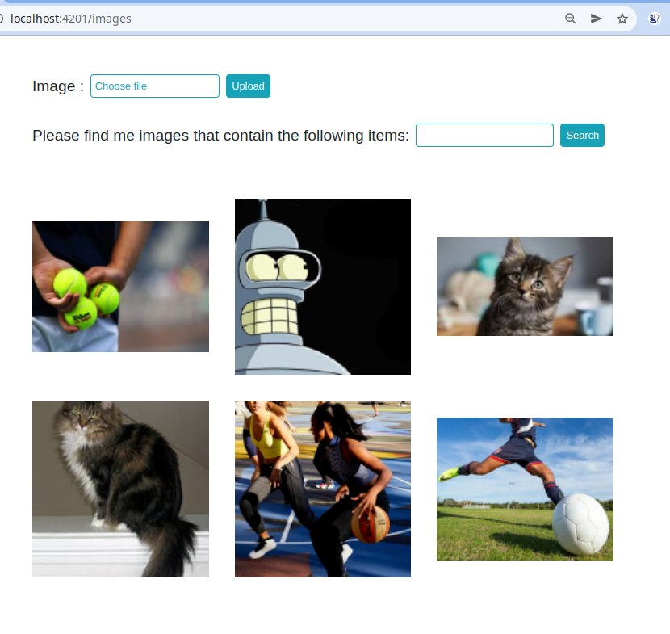

# Aws application 
 AWS web application that allows uploading images and store them.
Spring Boot Application to demonstrate AWS Rekognition.
 - Allows you to upload an image to aws s3. 
 - Get information about objects, people, text, scenes, and activities in images  
 - Search image by detected information on image  
 


search cat on image result 


search ball on images 


##  Backend application startup instruction 


put aws credential to application-local.properties

```
aws.region=
aws.accessKey=
aws.secretKey=
```
on path 
```
aws-application-backend/src/main/resources
```
(see https://aws.amazon.com/de/blogs/security/wheres-my-secret-access-key/)
run with maven 
```
    mvn spring-boot:run 
```

angular client 
```
 ng serve --port 4201
```


Supported image format 

Max image size 
